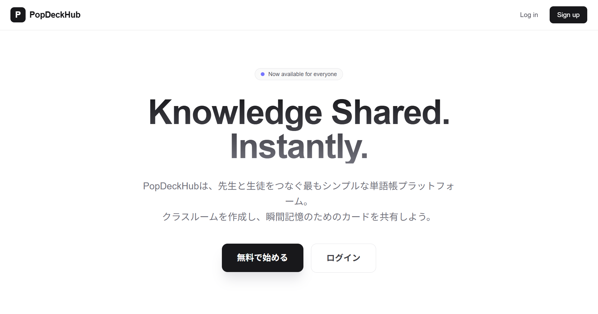
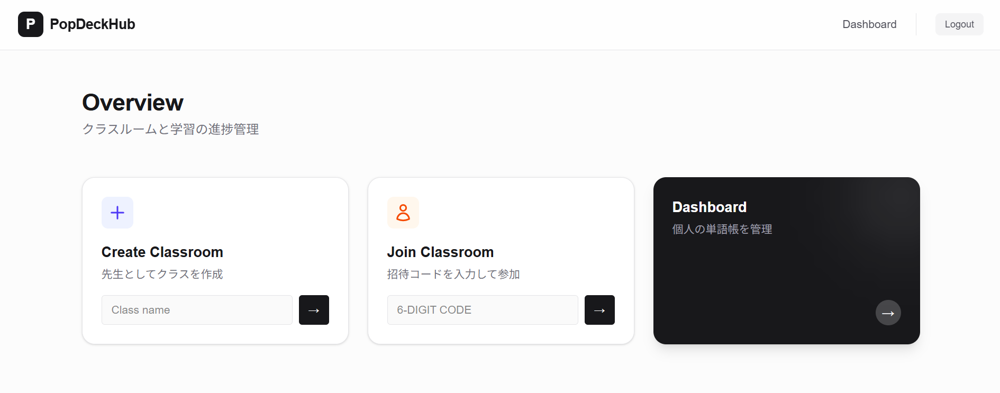
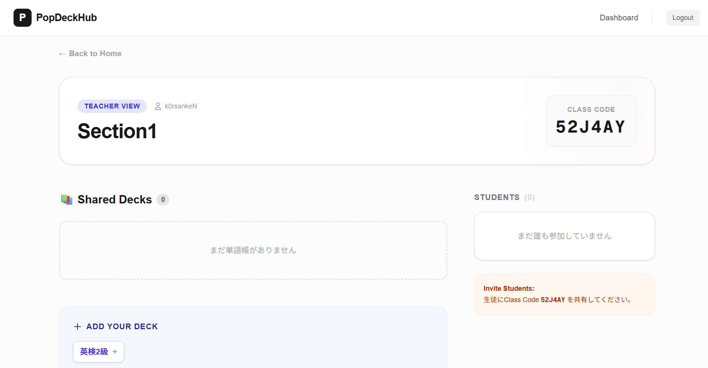
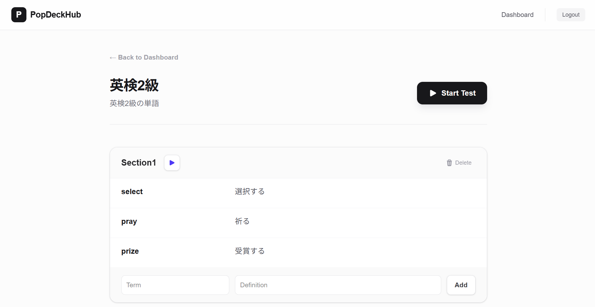
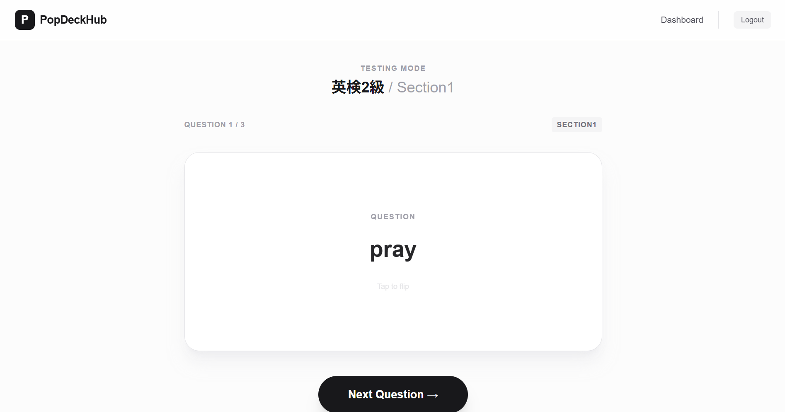
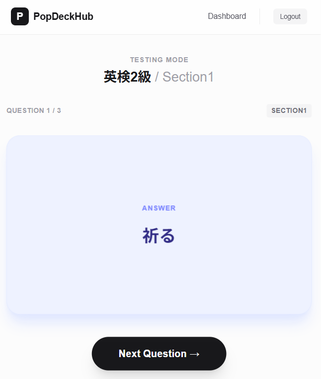

# PopDeckHub


**Knowledge Shared. Instantly.**  
先生と生徒をつなぐ、シンプルでモダンな単語帳プラットフォーム。  
  
制作: 安部 航生  
制作時間: 20時間

[デプロイされたサイト (Vercel)](https://pop-deck-hub.vercel.app/)



## 概要 (Overview)
**PopDeckHub** は、クラスルーム機能を持った単語帳Webアプリケーションです。
従来の単語帳アプリは「個人の学習」に特化したものが多いですが、本アプリは「先生が作成した教材を、生徒が瞬時に受け取って学習する」という **教育現場での共有** に焦点を当てて開発しました。

### 主な機能
* **認証機能**: GitHubアカウント または メールアドレス/パスワードでの安全なログイン。
* **単語帳作成**: 直感的なUIで、セクションごとに区切られた単語帳を作成。
* **学習モード**: 3Dフリップアニメーションによる暗記カード体験。
* **クラスルーム機能**:
    * **先生**: クラスを作成し、招待コードを発行。作成した単語帳をクラスに追加。
    * **生徒**: コードを入力してクラスに参加。先生が共有した単語帳で学習。
* **レスポンシブUI**: スマホ・PC両対応のモダンなSaaS風デザイン。

## 外観 (Preview)

レスポンシブ対応しており、PCでもスマートフォンでも快適に学習できます。

| オーバービュー | ダッシュボード |
| :---: | :---: |
|  |  |
| **ログイン時のランディングページ**<br>シンプルで洗練されたデザインでユーザーを迎えます。 | **ユーザー個人の管理画面**<br>作成した単語帳の管理や、学習進捗を一目で確認できます。 |

| クラスルーム機能 | 単語帳作成機能 |
| :---: | :---: |
|  |  |
| **クラスルームの管理画面**<br>先生と生徒のユースケースを想定した共有機能です。 | **単語帳の作成画面**<br>セクションを作成し、セクションの中に単語を登録していきます。 |

| 学習モード  | スマートフォン表示  |
| :---: | :---: |
|  |  |
| **3Dフリップアニメーション**<br>クリック/タップでカードが回転。直感的な操作で暗記学習が進みます。 | **モバイル完全対応**<br>通学時間などの隙間時間でも、片手でストレスなく操作可能です。 |

## 使用技術 (Tech Stack)
採用担当の方に向けて、本プロジェクトで採用した技術スタックとその選定理由を記載します。

| Category | Technology | Reason for selection |
| :--- | :--- | :--- |
| **Frontend** | Next.js (App Router) | 最新のReact Server Components (RSC) を活用し、初期ロードの高速化とSEOを意識するため。 |
| **Styling** | Tailwind CSS | クラス名命名のコストを削減し、一貫性のあるモダンなデザインシステム（Zinc/Indigoテーマ）を迅速に構築するため。 |
| **Backend** | Server Actions | APIルートを別途定義せず、フォーム操作から直接DB操作を行うことで、型安全かつシンプルなデータフローを実現するため。 |
| **Database** | PostgreSQL (Vercel Postgres) | リレーショナルデータ（ユーザー、クラス、単語帳の関係性）の管理に最適であるため。 |
| **ORM** | Prisma | スキーマ駆動開発により、型安全なDB操作を行い、開発効率を向上させるため。 |
| **Auth** | NextAuth.js (v5) | GitHub OAuthとCredentialsプロバイダーを併用し、セキュアな認証基盤を低コストで実装するため。 |
| **Infra** | Vercel | Next.jsとの親和性が高く、CD（継続的デリバリー）環境を即座に構築できるため。 |

## データベース設計 (ER Diagram)
ユーザー、クラスルーム、単語帳の関係性を以下のように設計しました。

```mermaid
erDiagram
    User ||--o{ Account : "OAuth linkage"
    User ||--o{ Classroom : "teaches"
    User ||--o{ Deck : "owns"
    User }|--|{ Classroom : "joins (m:n)"

    Classroom ||--|{ Deck : "contains (m:n)"

    Deck ||--o{ Section : "has"
    Section ||--o{ Card : "has"

    User {
        String id
        String email
        String password
        String name
    }
    Classroom {
        String id
        String code
        String teacherId
    }
    Deck {
        String id
        String title
        Boolean isPublic
    }